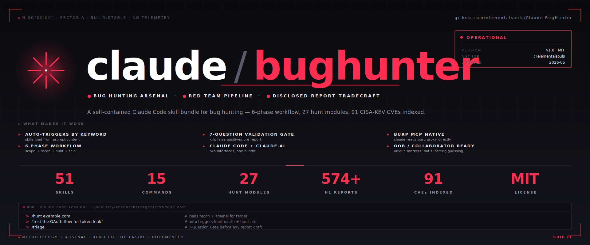
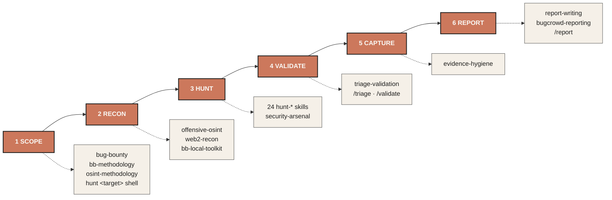

<p align="center">
  
</p>

<p align="center">
  <strong>A Claude Code skill bundle for bug hunting.</strong><br>
  40 skills · 15 slash commands · engagement scaffolding · curated from 574+ disclosed HackerOne reports.
</p>

<p align="center">
  <a href="#quick-start">Quick start</a> ·
  <a href="#whats-inside">What's inside</a> ·
  <a href="#architecture">Architecture</a> ·
  <a href="#why-this-exists">Why this exists</a> ·
  <a href="docs/credits.md">Credits</a>
</p>

---

## What is this?

A self-contained skill bundle for [Claude Code](https://claude.ai/download) that turns it into a focused bug-hunting collaborator. Install once and Claude knows:

- **24 vulnerability classes** — RCE, SSRF, XSS, IDOR, OAuth, race conditions, SAML, SSTI, cache poisoning, HTTP smuggling, prompt injection, and more — each with detection patterns, payloads, and chain templates curated from real disclosed HackerOne reports.
- **The full hunt workflow** — scope intake → recon → hunt → validate → capture evidence → report. Skills auto-trigger by topic; you don't invoke them by name.
- **Bugcrowd-specific reporting tactics** — VRT category fallback, severity-request paragraphs, OOS-clause rebuttals, chained-finding cross-references.
- **Evidence hygiene as a first-class concern** — cookie redaction, PII black-bar discipline, HAR sanitization, screenshot capture order.
- **Engagement scaffolding** — a `hunt <target>` shell command that creates a per-engagement folder with all the files you need.

---

## Quick start

```bash
git clone https://github.com/elementalsouls/Claude-BugHunter.git
cd Claude-BugHunter
./scripts/install.sh
```

Done. Open a fresh terminal:

```bash
hunt acme-bb              # scaffolds ~/Targets/acme-bb/
cd ~/Targets/acme-bb
claude                    # opens Claude Code in this folder
```

In Claude, describe what you're testing in plain English — *"I see a `?url=` parameter, looks SSRF-prone"* — and the relevant skill auto-loads. No need to invoke skills by name.

For Burp Suite Pro MCP integration and the optional skill-regenerator setup, see [INSTALL.md](INSTALL.md). For the full workflow walkthrough with a worked example, see [USAGE.md](USAGE.md).

---

## Architecture

The bundle maps to a 6-phase bug-hunting workflow. Skills compose left-to-right; you can also jump in at any phase mid-engagement.



Detailed skill-to-phase mapping in [docs/architecture.md](docs/architecture.md).

---

## What's inside

### 24 per-class hunt skills — curated from disclosed HackerOne reports

| Skill | Reports | Skill | Reports |
|---|---|---|---|
| `hunt-misc` | 225 | `hunt-csrf` | 10 |
| `hunt-xss` | 174 | `hunt-oauth` | 10 |
| `hunt-rce` | 67 | `hunt-ssrf` | 9 |
| `hunt-idor` | 26 | `hunt-sqli` | 8 |
| `hunt-subdomain` | 11 | `hunt-business-logic` | 7 |
| `hunt-cache-poison` | 4 | `hunt-auth-bypass` | 4 |
| `hunt-xxe` | 4 | `hunt-graphql` | 3 |
| `hunt-race-condition` | 3 | `hunt-saml` | curated |
| `hunt-ato` | curated | `hunt-mfa-bypass` | curated |
| `hunt-http-smuggling` | curated | `hunt-ssti` | curated |
| `hunt-file-upload` | curated | `hunt-api-misconfig` | curated |
| `hunt-cloud-misconfig` | curated | `hunt-llm-ai` | curated |

Plus: `hunt-cache-poisoning`, `hunt-race`, `hunt-subdomain-takeover` (alternate / hand-crafted variants).

### Workflow + reporting

| Skill | Purpose |
|---|---|
| `bb-methodology` | 5-phase non-linear hunting workflow + critical-thinking framework |
| `bug-bounty` | Master orchestrator |
| `bb-local-toolkit` | Full pipeline router for local cloned bug-bounty repos |
| `triage-validation` | 7-Question Gate, 4 pre-submission gates, never-submit list |
| `report-writing` | H1/Bugcrowd/Intigriti/Immunefi templates, CVSS 3.1 + 4.0 |
| **`bugcrowd-reporting`** | VRT category fallback, severity-request paragraph, OOS rebuttals, chained-finding patterns |
| **`evidence-hygiene`** | Cookie redaction, PII black-bar, HAR sanitization, screenshot capture order |

### Recon

| Skill | Purpose |
|---|---|
| **`offensive-osint`** | 15 modular reference files: subdomain enum, identity fabric, secret patterns, dorks, sector-specific recon |
| **`osint-methodology`** | 5-stage recon pipeline + 29-type asset graph + severity rubric |
| `web2-recon` | Subdomain enumeration, host discovery, URL crawling |

### Specialized

| Skill | Purpose |
|---|---|
| `security-arsenal` | Payloads, bypass tables, wordlists, gf patterns |
| `web3-audit` | 10 DeFi bug classes, Foundry PoC template |
| `meme-coin-audit` | Token rug-pull detection |

### 15 slash commands

`/hunt` `/recon` `/scope` `/triage` `/validate` `/report` `/autopilot` `/chain` `/intel` `/pickup` `/surface` `/remember` `/memory-gc` `/token-scan` `/web3-audit`

### Tooling

- **`hunt <target>`** — shell command that scaffolds `~/Targets/<name>/` with `CLAUDE.md`, `scope.md`, `findings/`, `evidence/`, `submissions.txt`, `notes.md`, and a sensible `.gitignore`
- Burp Suite Pro MCP integration (see [INSTALL.md](INSTALL.md))

---

## Why this exists

Most bug-hunting Claude setups are either generic (one big "security" prompt) or fragmented (you bookmark 30 disclosed reports and re-read them every engagement). Neither scales.

This bundle was built and validated through a real Bugcrowd engagement on a major financial target. That engagement exposed four capability gaps in a starter stack:

1. **No hypothesis discipline** — drafts written before validation → wasted hours, hurt validity ratio
2. **No per-program reporting tactics** — VRT defaults auto-downgraded findings that should have been P3+
3. **No engagement coordination** — findings, evidence, and submission IDs scattered across folders
4. **No evidence hygiene** — screenshots leaked cookies and victim PII

The 24 per-class `hunt-*` skills address the gap-zero question (*"what should I look for"*) by codifying patterns from 574+ disclosed reports — so Claude knows the actual chain templates real triagers paid for, not abstract OWASP Top 10. The `bugcrowd-reporting`, `evidence-hygiene`, `triage-validation`, and `hunt` shell scaffold address the other four gaps directly.

---

## Roadmap

- [ ] HackerOne MCP integration (currently only Burp MCP wired in)
- [ ] Per-engagement memory layer — pattern recall across engagements
- [ ] Industry-specific hunt skills — `hunt-fintech-graphql`, `hunt-healthcare-fhir`, `hunt-gov-compliance`
- [ ] Program-rules-parser skill — auto-generate structured `scope.md` from program text
- [ ] Refresh `hunt-*` skills with newer disclosed reports (re-run `public-skills-builder`)

---

## Status

- ✅ 40 skills + 15 commands installable in one step
- ✅ Burp MCP integration documented and working
- ✅ Validated end-to-end on a real Bugcrowd engagement
- 🔄 HackerOne MCP integration is in upstream's repo but not yet wired into this stack

---

## Credits

This bundle stands on community foundations. Full attribution in [docs/credits.md](docs/credits.md). The short version:

- **32 of 40 skills are original/curated work in this repo** — including all 24 `hunt-*` skills (curated from disclosed H1 reports), `offensive-osint` v3.0 (refactored from a 4,168-line monolith into 15 modular references), `osint-methodology`, `bugcrowd-reporting`, `evidence-hygiene`, and `bb-local-toolkit`.
- **8 foundation skills + 15 slash commands vendored** from [shuvonsec/claude-bug-bounty](https://github.com/shuvonsec/claude-bug-bounty) — `bb-methodology`, `bug-bounty`, `triage-validation`, `report-writing`, `security-arsenal`, `web2-recon`, `web3-audit`, `meme-coin-audit`. MIT-licensed, retain their original license.
- **`public-skills-builder`** ([shuvonsec](https://github.com/shuvonsec/public-skills-builder)) — generator tool used to produce the per-class hunt skills from H1 disclosed reports.
- **Burp Suite + MCP Server extension** — [PortSwigger](https://portswigger.net/burp).
- **Skill-authoring discipline** — [Trail of Bits](https://github.com/trailofbits/skills).
- **Claude Code, Skills protocol, MCP** — [Anthropic](https://anthropic.com).

---

## Contributing

PRs welcome — see [CONTRIBUTING.md](CONTRIBUTING.md). Especially valuable: per-program OOS rebuttal templates, industry-specific hunt skills, evidence-hygiene additions for new file formats.

---

## License

MIT — see [LICENSE](LICENSE).

Original work in this repo (32 skills, the `hunt` shell command, all docs, banner) is MIT-licensed by the author. Vendored upstream skills retain their original licenses (typically MIT — verify each upstream source listed in [docs/credits.md](docs/credits.md)).
